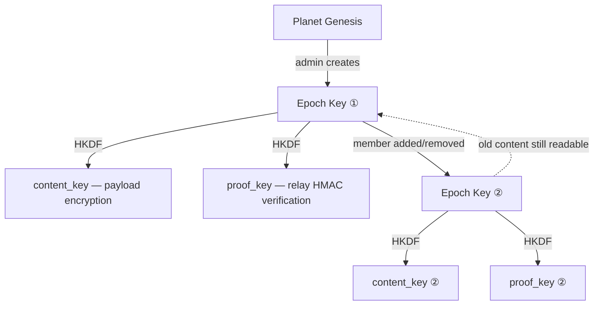

# art.media.platform

**_art.media.platform_** ("amp") is an open protocol and native 3D runtime for building communities that operate on their own terms.  Every participant holds their own keys.  Every device is a full peer.  Content propagates through a mesh of independent nodes — no central server, no corporate intermediary, no single point of failure.

Born from [PLAN](https://plan-systems.org/plan-technology-components/) (2019) and its cryptographic [proof of correctness](https://github.com/plan-systems/design-docs/blob/master/PLAN-Proof-of-Correctness.md), amp is the third generation of this architecture.

---

## The Problem

Most platforms follow the same pattern: your data lives on someone else's servers, encrypted with someone else's keys, subject to someone else's terms of service.  When that company gets acquired, shuts down, or decides to change the rules — you lose.

In crisis scenarios — natural disasters, infrastructure collapse, conflict zones — centralized platforms fail precisely when communication matters most.  Cell towers go down, internet links sever, and the tools people depend on become unreachable.

This infrastructure exists to protect families, communities, and things precious to you.

---

## Planets

The core abstraction is a **planet** — a cryptographic governance enclosure maintaining membership, channels, encryption keys, and history.  A planet is not a server.  It is a cryptographic identity shared among its members, replicated across their devices and any relay nodes they choose to trust.

A planet contains **channels** — persistent, organized under an access control tree.  Members post **transactions** ([`TxMsg`](https://github.com/art-media-platform/amp.SDK/blob/main/amp/api.app.go#L94)) that propagate through whatever network links are available — TCP, UDP, USB stick, or your favorite cutting-edge mesh-networking transport.  Every TxMsg is signed by its author and optionally encrypted with the planet's current epoch key.

| Mode | Signed | Encrypted | Who Can Read | Who Can Write |
|------|--------|-----------|-------------|--------------|
| **Public** | Yes | No | Anyone | Planet members |
| **Planet-private** | Yes | Planet epoch key | Planet members | Planet members |
| **Channel-private** | Yes | Channel epoch key | Channel members only | Channel members only |

A private planet can contain public channels (visible to all members) alongside private channels (visible only to channel participants — even other planet members cannot decrypt them).

### [CRDT](https://en.wikipedia.org/wiki/Conflict-free_replicated_data_type) Addressing

Every piece of state has a unique [`amp.Address`](https://github.com/art-media-platform/amp.SDK/blob/main/stdlib/tag/api.tag.go#L27): `(planet, node ("channel"), attribute, item, edit)`.  When two members edit the same item offline and later sync, the edits merge deterministically.  No authoritative server.  Every peer holds a valid replica.  The [data model itself guarantees convergence](https://crdt.tech/).


### Epochs and Key Rotation

A planet's encryption key changes over time through **epoch rotation**.  When an admin rotates the epoch — to revoke a member, respond to a compromise, or as routine hygiene — a new symmetric key is generated and distributed to each active member, [encrypted individually with their public key](https://en.wikipedia.org/wiki/Public-key_cryptography).  Revoked members never receive the new key.  Historical content remains readable with old epoch keys; new content is sealed under the new epoch.



| Layer | Key Type | Who Can Decrypt | Rotation Trigger |
|-------|----------|----------------|-----------------|
| **Planet-private** | Symmetric epoch key (shared by all planet members) | Planet members only | Member remove, compromise, routine hygiene, rebase |
| **Channel-private** | Symmetric channel key (shared by channel members) | Channel members only | Channel membership change; also invalidated by planet epoch rotation |
| **Public** | None (signed but unencrypted) | Anyone | n/a|

A private planet can contain public channels (visible to all members) alongside private channels (invisible even to other planet members).

### Zero-Knowledge Relay

Relay nodes ("vaults") store and forward encrypted TxMsgs.  A vault verifies that a message was authored by a legitimate planet member — via an [HMAC](https://en.wikipedia.org/wiki/HMAC) membership proof derived from the epoch key — without ever decrypting the content or learning who authored it.

**A vault seized in any jurisdiction yields zero usable content.**  It holds opaque encrypted blobs and membership proofs.  No epoch keys.  No private keys.  No author identity.  You could run relay infrastructure in China, Russia, or any jurisdiction with adversarial data access laws, and sleep soundly — they literally cannot access the data they're relaying.

---

## AI Interoperability

amp's channel/attribute addressing is a natural fit for AI agents.  An AI daemon subscribes to specific channels — and *only* those channels.  This provides structural compartmentalization: an AI assistant processing `chat-support` never receives keys for `medical-records` or `financial-ledger`, not because of a policy document, but because it was never granted the channel epoch key.

- **Scoped access by default** — cryptographic enforcement, not access-control lists
- **Auditable** — every AI-authored TxMsg is signed, attributed, and immutable in the journal
- **Instantly revocable** — rotate the channel epoch key and the AI loses access, no token dance

---

## Reticulum

[Reticulum](https://reticulum.network/) is a cryptography-based mesh networking stack with a [growing community](https://github.com/markqvist/Reticulum) building wide-area networks on unreliable, mixed-medium infrastructure — [LoRa](https://en.wikipedia.org/wiki/LoRa) radio, packet radio, serial links, TCP, UDP, I2P.

amp and Reticulum are architecturally aligned: both are peer-to-peer by construction, both separate identity from location via cryptographic keys, both handle intermittent connectivity gracefully.  amp encrypts at the application layer (persistent, stored on disk); Reticulum encrypts at the transport layer (ephemeral, wire protection).  Complementary, not redundant.

The [`vault.Transport`](https://github.com/art-media-platform/amp.planet/blob/main/amp/vault/api.vault.go#L19) interface makes amp fully transport-agnostic.  Reticulum over LoRa gives amp nodes mesh federation without internet, cell towers, or any centralized infrastructure — disaster response teams, rural classrooms, field teams in denied environments, all running encrypted CRDT channels over radio.

---

## Security Model

Three principles:

1. **One TxMsg = one encryption context.**  Each transaction is encrypted under exactly one epoch key.  To write to two different private channels, author two separate TxMsgs.

2. **Author identity is hidden.**  The `FromID` lives inside the encrypted payload, not the cleartext envelope.  Relay vaults and passive observers see the planet, the epoch, and a membership proof — never the author.

3. **Pluggable cryptography.**  All crypto operations go through [`safe.CryptoKit`](https://github.com/art-media-platform/amp.SDK/blob/main/stdlib/safe/api.safe.go#L136) — a suite abstraction that isolates algorithm-specific code.  When post-quantum [KEM](https://en.wikipedia.org/wiki/Key_encapsulation_mechanism) schemes mature, you just invoke a newer CryptoKit, not a new architecture.

### Key Hierarchy

```
Member Signing Key (asymmetric, per member, never leaves device)
  │
  ├── Planet Epoch Key (symmetric, shared by all planet members)
  │     Derived subkeys:
  │       content_key  = HKDF(epoch_key, "content")      → payload encryption
  │       proof_key    = HKDF(epoch_key, "member-proof") → relay verification
  │
  └── Channel Epoch Key (symmetric, shared by channel members only)
        Derived from BOTH channel + planet epoch keys:
          content_key = HKDF(channel_key ║ planet_key, "content")
        → Rotating the planet epoch invalidates ALL channel keys automatically
```

### Security Properties

| Property | Mechanism | Reference |
|----------|-----------|-----------|
| **Encryption at rest** | AEAD with epoch-derived `content_key` | [`safe.CryptoKit`](https://github.com/art-media-platform/amp.SDK/blob/main/stdlib/safe/api.safe.go#L136) |
| **Author authentication** | Digital signature over `TxMsg` digest | [`safe.Enclave`](https://github.com/art-media-platform/amp.SDK/blob/main/stdlib/safe/api.safe.go) |
| **Relay zero-knowledge** | HMAC `MemberProof` from `proof_key` — verifies membership without decryption | [PRD-amp-security-sync](https://github.com/art-media-platform/amp.planet/blob/main/docs/PRD-amp-security-sync.md) |
| **Key material isolation** | All keys live in `safe.Enclave`, never exported in plaintext | [`safe.Enclave`](https://github.com/art-media-platform/amp.SDK/blob/main/stdlib/safe/api.safe.go) |
| **Transport encryption** | Layered — amp encrypts at application layer; transport (Reticulum, TLS) encrypts at wire layer | [`vault.Transport`](https://github.com/art-media-platform/amp.planet/blob/main/amp/vault/api.vault.go#L19) |
| **Post-quantum readiness** | `CryptoKit` abstraction isolates algorithm-specific code; swap the kit, not the architecture | [`safe.CryptoKit`](https://github.com/art-media-platform/amp.SDK/blob/main/stdlib/safe/api.safe.go#L136) |

---

## Why a 3D Runtime?

The next decade of computing is spatial.  AR/VR headsets, digital twins, geospatial logistics, immersive collaboration — these are active markets with real deployments today.  But every major spatial platform is a walled garden: Meta's Horizon, Apple's visionOS, Google's ARCore.

art.media.platform provides the security and communication layer that spatial applications need without corporate lock-in.  It ships as an embeddable C library for [Unity](https://unity.com) and [Unreal](https://unrealengine.com), or as a standalone server binary (`amp.exe`) for headless operation.

A Unity app with amp embedded has end-to-end encrypted federated communication, offline-capable CRDT state, authenticated media streaming, and mesh networking — all without a single line of server code or a single dependency on a cloud provider.

**Platforms:** Windows, macOS, Linux, iOS, Android, XR headsets (Meta Quest, Apple Vision).  The same binary that runs a headless vault on a Raspberry Pi serves a VR collaboration space.

---

## Architecture

```
amp.Host
  ├── vault.Controller (journal, outbox, sync engine)
  │     └── vault.Transport (Reticulum, TCP, UDP, ...)
  ├── HttpService (asset streaming, REST, WebSocket)
  └── Sessions (one per connected client)
       ├── Enclave (identity keys, never leaves device)
       ├── EpochKeyStore (symmetric epoch keys)
       └── AppInstances
            ├── app.home (member identity, planet subscriptions)
            ├── app.members (epoch key extraction, governance)
            ├── app.cabinets (persistent key-value storage)
            └── your.app (custom functionality)
```

Every long-lived object is a node in a [`task.Context`](https://github.com/art-media-platform/amp.SDK/blob/main/stdlib/task/api.task.go#L59) tree.  Closing a parent closes all children.  The host operates fully offline — sync happens opportunistically when connectivity is available.

### Core Packages

| Package | Purpose |
|---------|---------|
| [`amp/`](https://github.com/art-media-platform/amp.SDK/tree/main/amp) | Core types: [`TxMsg`](https://github.com/art-media-platform/amp.SDK/blob/main/amp/api.app.go#L94), [`Session`](https://github.com/art-media-platform/amp.SDK/blob/main/amp/api.host.go#L86), [`AppModule`](https://github.com/art-media-platform/amp.SDK/blob/main/amp/api.app.go#L31), CRDT bindings |
| [`stdlib/safe/`](https://github.com/art-media-platform/amp.SDK/tree/main/stdlib/safe) | [`Enclave`](https://github.com/art-media-platform/amp.SDK/blob/main/stdlib/safe/api.safe.go), [`CryptoKit`](https://github.com/art-media-platform/amp.SDK/blob/main/stdlib/safe/api.safe.go#L136), key management, AEAD, HKDF |
| [`stdlib/tag/`](https://github.com/art-media-platform/amp.SDK/tree/main/stdlib/tag) | Universal tagging and addressing |
| [`stdlib/task/`](https://github.com/art-media-platform/amp.SDK/tree/main/stdlib/task) | Goroutine lifecycle management (parent-child process model) |

---

## Getting Started

This repo is the SDK — lightweight, dependency-minimal, safe to add to any Go project.

1. Add [amp.SDK](https://github.com/art-media-platform/amp.SDK) to your Go project
2. Implement an [`amp.AppModule`](https://github.com/art-media-platform/amp.SDK/blob/main/amp/api.app.go#L31) for your functionality
3. Clone [amp.planet](https://github.com/art-media-platform/amp.planet) and register your module
4. `make build` produces `amp.exe` (standalone server) and `amp.lib` (embeddable C library)
5. For web apps, use the [`@amp/client`](https://github.com/art-media-platform/amp.planet/tree/main/amp-client) TypeScript SDK with React hooks

See [amp.planet](https://github.com/art-media-platform/amp.planet) for build instructions, deployment guides, and runtime documentation.

---

## Lineage

amp is not a first attempt.  It builds on years of production experience:

- **[PLAN](https://plan-systems.org/plan-technology-components/)** (2017-2019) — the first generation, shipped as [plan-go](https://github.com/plan-systems/plan-go/tags).  Established the core security model: nested cryptographic containers, epoch-based key rotation, zero-knowledge relay nodes.
- **[PLAN Proof of Correctness](https://github.com/plan-systems/design-docs/blob/master/PLAN-Proof-of-Correctness.md)** — the formal [security architecture](https://github.com/plan-systems/design-docs) that amp inherits.
- **art.media.platform** (2022-present) — third generation.  Modernized for native 3D runtimes, mesh networking ([Reticulum](https://reticulum.network/)), and pluggable cryptography ([`CryptoKit`](https://github.com/art-media-platform/amp.SDK/blob/main/stdlib/safe/api.safe.go#L136) abstraction for future post-quantum suites).

The cryptographic fundamentals are not novel on purpose.  amp uses well-studied primitives (HKDF, AEAD, ECDH, digital signatures) composed in a well-studied pattern (encrypt-then-sign with epoch rotation).  The innovation is in the *systems design* — making these guarantees practical for real communities running on real hardware over unreliable networks.

---

## License

See [LICENSE](LICENSE).
